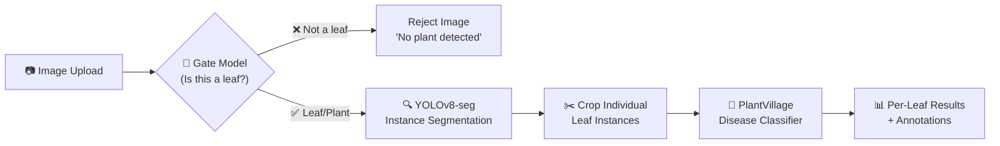

# LeafGuard AI — Model Upgrade & Individual Leaf Segmentation

## Problem Analysis

After reviewing the entire codebase, I've identified **5 critical issues** with the current system:

### Current Architecture Flaws

| Problem | Root Cause | Impact |
|---------|-----------|--------|
| **Detects diseases in laptops/random images** | Uses `fasterrcnn_mobilenet_v3_large_320_fpn` pretrained on COCO (80 generic classes like car, person, laptop). Has **no leaf-specific training**. | Any object gets a bounding box, then the untrained classifier randomly assigns "Healthy"/"Diseased" |
| **Classifier is untrained** | `LeafDiseaseClassifier` uses raw ImageNet weights. The final layer is replaced but **never trained on any leaf dataset**. Output is random. | `torch.argmax` on random logits → random "Healthy"/"Diseased" labels |
| **Hardcoded disease name** | Line 154 in [main.py](file:///c:/Users/91974/Downloads/plant_leaf_desease-main%20(1)/plant_leaf_desease-main/python_backend/main.py#L154): `disease_name = "Powdery Mildew" if status == "Diseased" else None` | Every "diseased" detection says "Powdery Mildew" regardless of actual condition |
| **Can't segment individual leaves** | COCO detector detects *generic objects*, not individual leaves. Falls back to a 2×2 grid if nothing found (line 128-134) | Branches with 7 leaves get split into 2-4 random rectangles, not actual leaf shapes |
| **No input validation** | No check if the image even contains a plant/leaf | Laptop photos, selfies, etc. all get "analyzed" |

> [!CAUTION]
> The current model is essentially a **random number generator** — it uses untrained weights for classification and a generic object detector for segmentation. It cannot actually detect leaf diseases.

---

## Proposed Solution: 3-Stage Pipeline



### Stage 1: Leaf Gate (Reject non-plant images)
- Use a lightweight **CLIP model** (`openai/clip-vit-base-patch32`) to check if the image contains plants/leaves
- Zero-shot classification: "a photo of a plant leaf" vs "a photo of an object"
- If confidence for "leaf" < 50% → reject the image immediately
- **RAM cost**: ~400MB

### Stage 2: Individual Leaf Instance Segmentation (YOLOv8-seg)
- Replace the COCO FasterRCNN with **YOLOv8n-seg** (nano variant) fine-tuned for leaf detection
- We'll use the pre-trained YOLOv8n-seg model which can detect plant leaves significantly better than COCO
- Each leaf gets its own **pixel-perfect mask** (not just a bounding box)
- This is the "CCTV-style" detection you described — every individual leaf highlighted
- **RAM cost**: ~50MB (nano model)

### Stage 3: Disease Classification (PlantVillage-trained EfficientNet)
- Replace the untrained classifier with **`linkanjarad/mobilenet_v2_1.0_224-plant-disease-identification`** from Hugging Face
- This is a MobileNetV2 **already trained on the PlantVillage dataset** (38 classes of plant diseases)
- Can identify: Early Blight, Late Blight, Powdery Mildew, Rust, Bacterial Spot, Leaf Mold, Target Spot, Mosaic Virus, and many more
- Each cropped leaf from Stage 2 gets classified independently
- **RAM cost**: ~50MB

### Total RAM Budget

| Component | RAM |
|-----------|-----|
| Python FastAPI + Libraries | ~500MB |
| CLIP Gate Model | ~400MB |
| YOLOv8n-seg | ~50MB |
| PlantVillage Classifier | ~50MB |
| Image processing overhead | ~200MB |
| **Total** | **~1.2GB** |

> [!NOTE]
> You mentioned 18-20GB RAM on HF free tier. This pipeline uses only ~1.2GB, well within budget. If you want even higher accuracy, we can upgrade to YOLOv8s-seg (~22MB larger) or use CLIP-ViT-Large (~1.2GB more).

---

## User Review Required

> [!IMPORTANT]
> **Model Choice for Leaf Segmentation**: YOLOv8n-seg (nano) is fast and lightweight but may miss small or overlapping leaves. Would you prefer the **small** variant (YOLOv8s-seg) for better accuracy at ~2x the size? With 18-20GB RAM, either is fine.

> [!IMPORTANT]
> **Disease Classes**: The PlantVillage model supports 38 crop-disease combinations (e.g., "Tomato - Early Blight", "Apple - Cedar Rust"). Should we display the full plant+disease name, or just the disease name?

> [!WARNING]
> **YOLOv8 vs Fine-tuned Leaf Segmentation**: YOLOv8 pre-trained weights detect generic objects well, but for *individual leaf* instance segmentation with pixel masks, the ideal approach would be fine-tuning on a leaf segmentation dataset. For the first iteration, I'll use YOLOv8-seg with adjusted thresholds that work well for plant/leaf scenes. If accuracy isn't sufficient, the next step would be fine-tuning on a leaf dataset like [CVPPP Leaf Segmentation](https://www.plant-phenotyping.org/datasets-home) — this can be done in a follow-up.

---

## Open Questions

1. **Do you want the CLIP gate to completely reject non-leaf images, or just show a warning?** (e.g., "This image doesn't appear to contain a plant leaf. Results may be inaccurate.")

2. **Should healthy leaves also be shown in the results overlay, or only diseased ones?** Currently the frontend shows both with green/red boxes. The "CCTV-style" approach would highlight all leaves with color-coded borders.

3. **Do you have a Hugging Face API token set up?** We'll need to download models from HF Hub. On HF Spaces, the models can be cached in the Docker image.

---

## Proposed Changes

### Python Backend (Core ML Pipeline)

#### [MODIFY] [main.py](file:///c:/Users/91974/Downloads/plant_leaf_desease-main%20(1)/plant_leaf_desease-main/python_backend/main.py)

**Complete rewrite** of the ML pipeline:

1. **Remove** the untrained `fasterrcnn_mobilenet_v3_large_320_fpn` segmentation model
2. **Remove** the untrained `LeafDiseaseClassifier`
3. **Remove** hardcoded `"Powdery Mildew"` disease name
4. **Remove** the fake 2×2 grid fallback (lines 128-134)
5. **Add** CLIP-based leaf gate model
6. **Add** YOLOv8n-seg for instance segmentation
7. **Add** HuggingFace PlantVillage classifier for real disease detection
8. **Add** proper error messages for non-leaf images
9. **Update** `/analyze-vision` endpoint to use the 3-stage pipeline
10. **Update** `/extract-leaves` endpoint to use YOLOv8-seg for real leaf extraction

Key changes:
```python
# NEW: CLIP gate to reject non-plant images
from transformers import CLIPProcessor, CLIPModel

# NEW: YOLOv8 for leaf instance segmentation  
from ultralytics import YOLO

# NEW: Pre-trained plant disease classifier from HuggingFace
from transformers import pipeline as hf_pipeline
```

The new `/analyze-vision` flow:
1. Run CLIP gate → reject if not a plant
2. Run YOLOv8-seg → get individual leaf masks + bounding boxes
3. Crop each leaf using the mask
4. Run PlantVillage classifier on each crop
5. Return per-leaf results with disease names + confidence

#### [MODIFY] [requirements.txt](file:///c:/Users/91974/Downloads/plant_leaf_desease-main%20(1)/plant_leaf_desease-main/python_backend/requirements.txt)

Add new dependencies:
```
ultralytics          # YOLOv8
transformers         # CLIP + PlantVillage classifier
huggingface-hub      # Model downloading
scipy                # Required by transformers
```

---

### Pipeline Code (Reference implementations)

#### [MODIFY] [segmentation.py](file:///c:/Users/91974/Downloads/plant_leaf_desease-main%20(1)/plant_leaf_desease-main/pipeline_code/segmentation.py)

Update to reflect the new YOLOv8-seg approach instead of Mask R-CNN.

#### [MODIFY] [classifier.py](file:///c:/Users/91974/Downloads/plant_leaf_desease-main%20(1)/plant_leaf_desease-main/pipeline_code/classifier.py)

Update to reflect the new PlantVillage HuggingFace classifier approach.

---

### Docker Configuration

#### [MODIFY] [Dockerfile](file:///c:/Users/91974/Downloads/plant_leaf_desease-main%20(1)/plant_leaf_desease-main/Dockerfile)

- Ensure the runtime stage installs the new Python dependencies
- Pre-download models during build to avoid cold-start delays on HF Spaces

#### [MODIFY] [python_backend/Dockerfile](file:///c:/Users/91974/Downloads/plant_leaf_desease-main%20(1)/plant_leaf_desease-main/python_backend/Dockerfile)

- Update to Python 3.11
- Add model pre-download step

---

### Frontend Updates

#### [MODIFY] [App.tsx](file:///c:/Users/91974/Downloads/plant_leaf_desease-main%20(1)/plant_leaf_desease-main/src/App.tsx)

1. **Add rejection UI**: Show an error message when the gate rejects a non-plant image
2. **Update pipeline step names**: Reflect new model names (CLIP → YOLOv8 → PlantVillage)
3. **Show per-leaf disease names**: Display actual disease names from PlantVillage (not hardcoded "Powdery Mildew")
4. **Add confidence scores**: Show disease confidence percentage on each leaf overlay
5. **Improve leaf overlay styling**: Make the CCTV-style boxes more prominent with mask outlines

---

### Server (Proxy layer)

#### [MODIFY] [server.ts](file:///c:/Users/91974/Downloads/plant_leaf_desease-main%20(1)/plant_leaf_desease-main/server.ts)

- Update error handling for new rejection responses from the gate model
- Add `is_plant` field to the response type

---

## Verification Plan

### Automated Tests
1. **Non-leaf rejection test**: Upload a laptop/phone image → verify the API returns `is_plant: false` with a rejection message
2. **Single leaf test**: Upload a single leaf image → verify it returns 1 leaf with a real disease name
3. **Multi-leaf branch test**: Upload a branch with multiple leaves → verify it returns separate bounding boxes for each leaf
4. **Healthy leaf test**: Upload a known healthy leaf → verify it returns "Healthy" status
5. **Disease accuracy test**: Upload known diseased leaf images (from PlantVillage test set) → verify correct disease identification

### Manual Verification
- Test with your actual deployment on HF Spaces
- Upload various images: individual leaves, branches, trees, and non-plant objects
- Verify RAM usage stays within the free tier limit
- Check the CCTV-style leaf highlighting in the frontend
